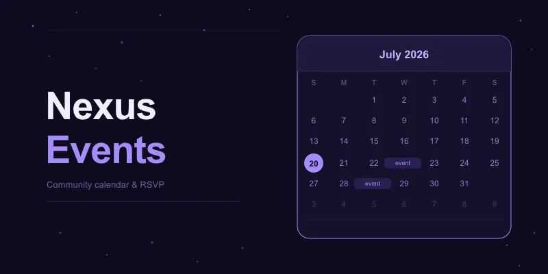

# Nexus Events

Community event scheduling for [Nexus](https://nexusprism.org). Attach events to posts, let members RSVP, and track your community calendar across month and week views.

## Installation

Install via **Admin → Extensions → Install from URL** using the manifest URL, or from the registry in the Nexus admin panel.

## Features

- **Post-linked events** — attach an event to any post via the composer toolbar; an event card appears inline below the post body
- **Month and week calendar views** — full monthly grid and a weekly time-slot view, both with today highlighting and navigation
- **RSVP system** — members attend or express interest; admins can set a cap per event; cancellations notify all RSVPs
- **Event detail modal** — cover image, title, date/time, location, description, attendee count, and RSVP controls in one view
- **Upcoming events sidebar widget** — shows the next few events on every feed page
- **Digest integration** — "Upcoming Events" section in digest emails
- **Admin panel** — list all events with upcoming/past filter, edit, cancel, and delete controls
- **Past event retention** — configurable automatic removal of old events (30 days → forever)

## Usage

Once installed, **Events** appears in the left sidebar Explore section and opens the calendar.

### Creating an event

Open the post composer and click the **calendar-plus** toolbar button. Fill in the event name, date and time, optional location, cover image, and description, then save. The event is attached to the post and appears on the calendar immediately.

### RSVP

Members click **Attending** or **Interested** (if "maybe" responses are enabled) on the event card or detail modal. Admins can cap attendance per event. Cancelling an event notifies all RSVPs via web and email notification.

## Permissions

| Permission | Default | Controls |
|---|---|---|
| `can_view_events` | everyone | Calendar and event detail |
| `can_create_event` | member | Create and attach events to posts |
| `can_rsvp` | member | RSVP to events |
| `can_view_attendees` | member | View the attendee list |
| `can_edit_any_event` | moderator | Edit events created by others |
| `can_cancel_event` | moderator | Cancel an event (notifies all RSVPs) |
| `can_delete_any_event` | moderator | Delete events created by others |
| `can_manage_events` | moderator | Access event management controls |

Configure in **Admin → Permissions → Events**.

## Settings

| Setting | Default | Description |
|---|---|---|
| Enable RSVP | true | Allow members to RSVP to events |
| Allow 'maybe' responses | false | Let members respond with "maybe / interested" |
| Default RSVP cap | 0 (unlimited) | Maximum RSVPs per event; 0 for no limit |
| Require cover image | false | Require a cover image when creating an event |
| Events per page | 20 | Number of events shown per page on the calendar |
| Keep past events for | Forever | Automatic removal schedule for past events |
